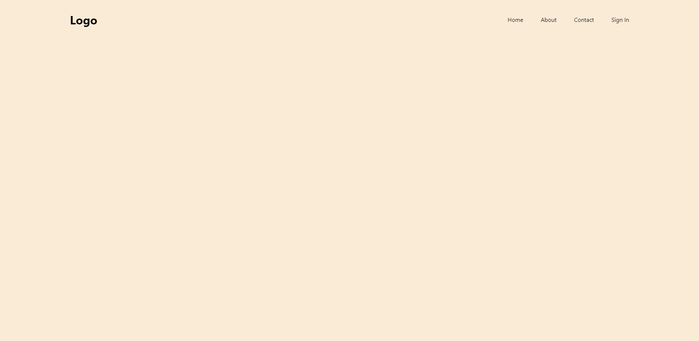
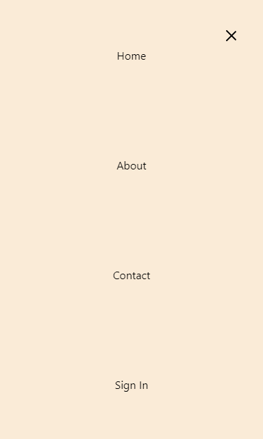

# Responsive Navbar

- For React
- Responsive Navbar component

https://www.npmjs.com/package/react_navbar_responsive

## Install

```cmd
npm install react_navbar_responsive --save
```

## Usage

**NOTE: The `Navbar` component must be a child of `Router` if you set `isRoute=true` in any of the `links`**

```javascript
import React from "react";
import { BrowserRouter as Router, Route } from "react-router-dom";
import "./App.css";
import Navbar from "./components/Navbar";

function App() {
  return (
    <div className="App">
      {/* NOTE: The Navbar component must be a child of Router if you set isRoute=true in any of the links */}
      <Router>
        <Navbar
          links={[
            {
              to: "/",
              text: "Home"
            },
            {
              to: "/about",
              text: "About",
              isRoute: true
            },
            {
              html: (
                <li>
                  <a href="/contact">Contact</a>
                </li>
              )
            },
            {
              to: "/signin",
              text: "Sign In"
            }
          ]}
        />
        <Route path="/about" exact />
      </Router>
    </div>
  );
}

export default App;
```

## Wide Screen (Desktop) Preview



## Mobile Preview



## Project Demo

https://github.com/elishaking/react_navbar_responsive_demo
